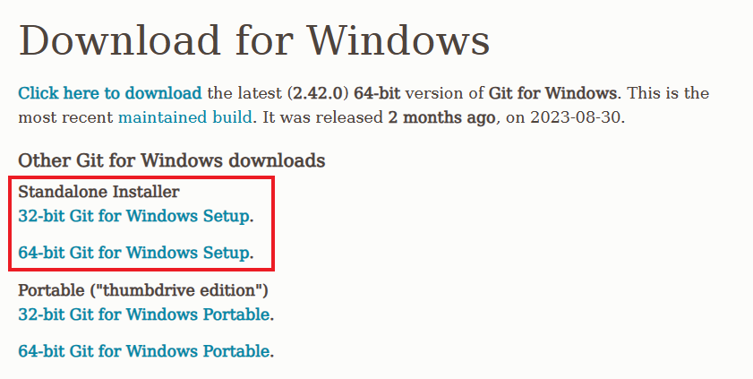
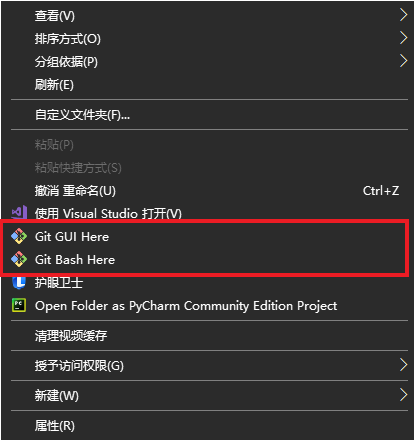
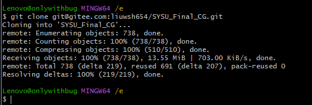
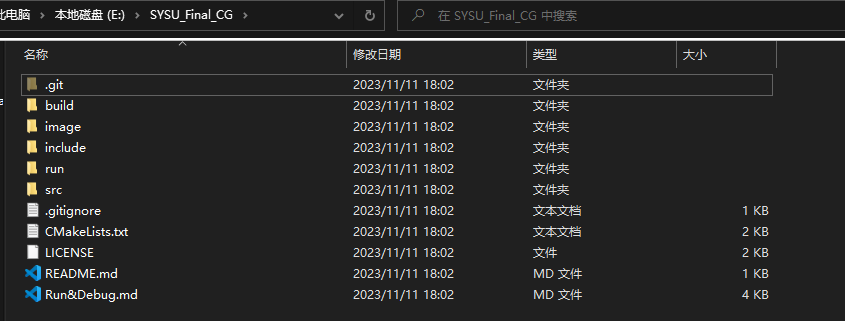
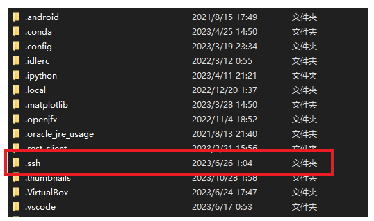
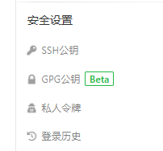
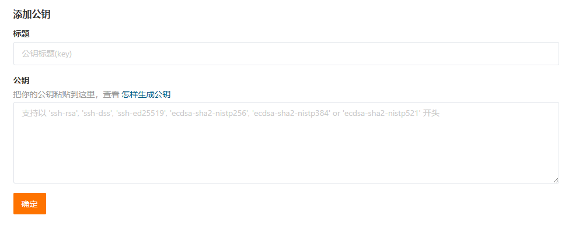
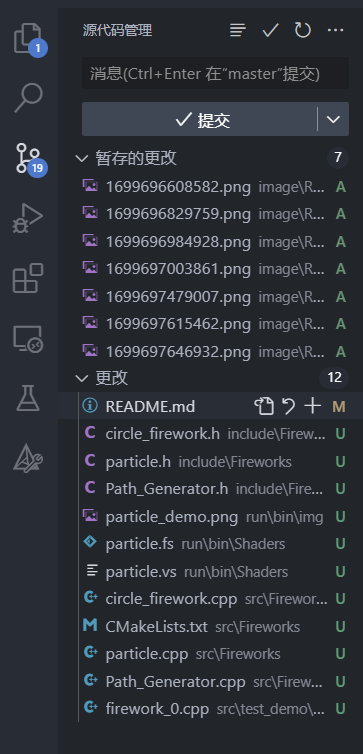
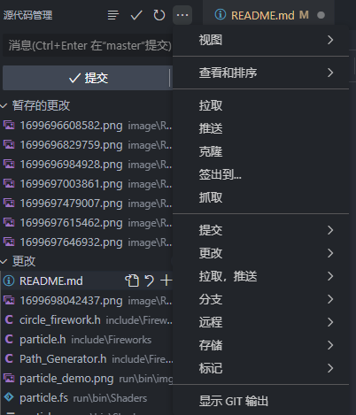
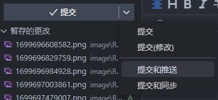

# SYSU-2021级CG-11组大作业

## 项目结构

- build: 构建目录
- include: 头文件目录
- run: 可执行文件以及库文件目录
    - Lib_Lib: 第三方库
    - bin: 可执行文件, 动态链接库, 资源文件(着色器, 图片, 模型等)
    - lib: 自定义库文件生成目录
- src: 项目源码
    - OpenGLTools: OpenGL必需的对象(包含教程中提供的与小组成员编写的)
    - test_demo: 测试样例
    - Object: 测试样例需要的杂项(后续用不到)

## 项目编译方式
lmj
进入 build 文件夹运行 make_build.bat 脚本即可编译程序, 生成的可执行文件在 run/bin目录下.

```
cd build
./make_build.bat
```

## 项目克隆方式

### 要求

安装有 Git, [下载链接](https://git-scm.com/downloads) 我们一般都是 Windows 系统, 所以进入后点击 Windows 进入下图页面, 根据自己的电脑 选择64位还是32位



下载完成后运行安装程序即可, 最简单的方式一路默认...

### 克隆

安装完成后, 进入你想要克隆仓库的位置, 右键会发现下图中两个选项, 选择 Git Bash Here 在该目录下打开 Git Bash



如果你是第一次使用 git 请先完成后面的配置公钥

输入下面的指令即可将仓库文件夹克隆到 Git Bash 打开的目录下, 我这里打开 E 盘

```
git clone git@gitee.com:liuwsh654/SYSU_Final_CG.git
```


SYSU_Final_CG 就是刚刚下载的项目文件夹



### 配置公钥

打开 Git Bash, 分别输入下面的三条命令, Your Name 填写你的名字, email@example.com 就填写你创建 Gitee 的邮箱.

```
git config --global user.name "Your Name"
git config --global user.email "email@example.com"
ssh-keygen -t rsa -C "youremail@example.com"
```

进入 C:/用户/Lenovo (这里就是除去公用的那个文件夹, 因为我的电脑是联想, 所以这里是Lenovo), 进入后可以看到下图类似的文件夹, 进入红框中的 .ssh 文件夹



此时应该有至少两个文件, id_ras 和 id_ras.pub , 用记事本打开 id_ras.pub 复制其中的全部内容.

进入 Gitee 个人设置界面, 找到安全设置里的 SSH 公钥.



将从 id_ras.pub 中全部内容复制到公钥中, 你可以起一个你喜欢的标题, 然后点击确定



## 拉取与推送

这里使用更为友好的 vscode 界面操作, 使用 vscode 打开刚刚下载的项目文件夹. 选择第三项, 源代码管理.



上图这里最主要的有三个部分
- 更改: 自从你上一次提交后所做出的修改
- 暂存的更改: 由你点击更改中的加号所添加的更改
- 提交: 将会提交所有暂存的更改, 需要你填写必要且简洁的提交信息描述你做出了哪些更改(不然会让你的队友犯难的)

当你点击右上角那三个点, 会看到所有操作(如下图)



- 拉取: 从 Gitee 上获取最新的内容到本地
- 推送: 将你本地所做的提交推送到 Gitee, 这样小组其他成员就可以看到你所完成的工作了

在提交的下箭头里, 也有提交和推送, 提交和同步可以使用(同步就是拉取并推送)



**总结**

修改项目的过程

1. 修改代码, 完善功能
2. 暂存更改
3. 提交更改
4. 拉取并推送到远程, 在 Gitee 可见