# 简单介绍并演示项目运行与调试办法

## 要求

禁用 Code Runner 拓展
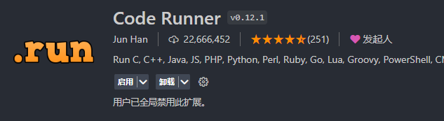

安装 CMake 拓展
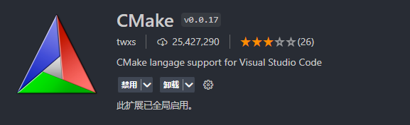

## 运行

### 方法一 使用 vscode 终端

1. 为了方便编译与运行新建两个终端, 可以看到我的项目的根目录是 E:\computer_graphics\final_project

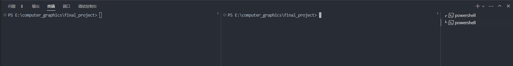

2. 终端分别进入 build 和 run/bin 目录下, 命令 `cd .\build\` 和 `cd .\run\bin\`

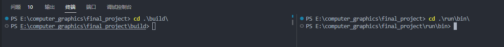

3. 根据 CMake 构建整个项目, 在 build 目录的终端中运行 make_build.bat 脚本 `.\make_build.bat`

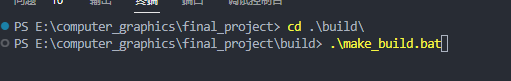

如果构建成功将会得到类似下图的输出, 没有任何报错

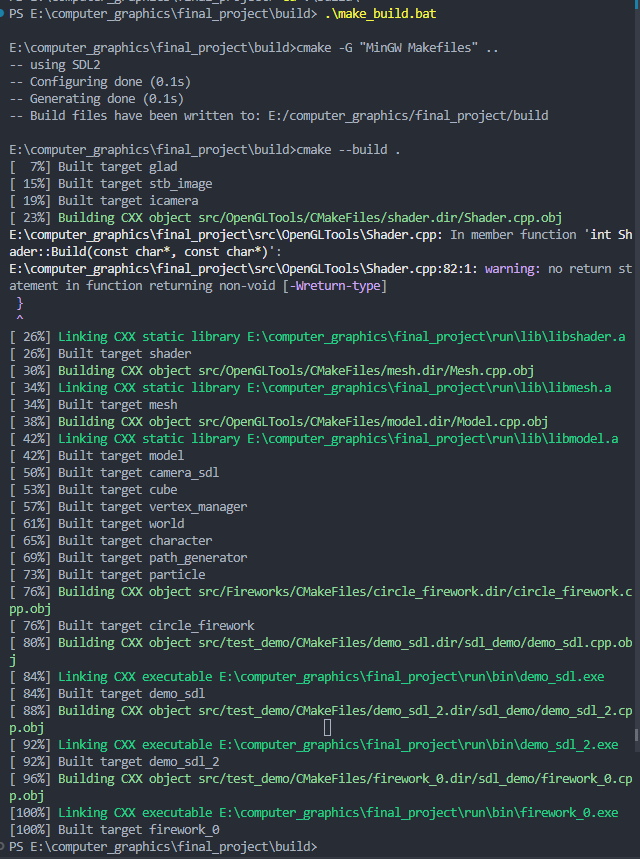

4. 在 run/bin 目录的终端中即可运行你想要运行的可执行文件, 这里运行 demo_sdl.exe

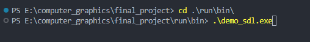

成功运行

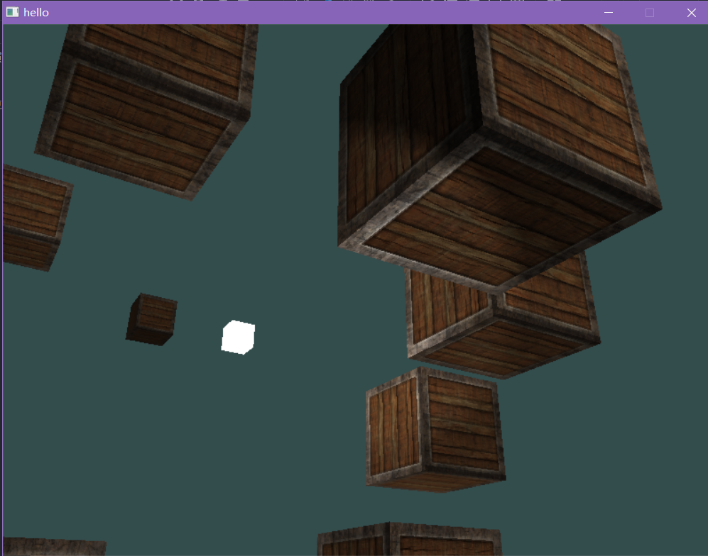

5. 当修改了代码后, 再 build 终端中重新运行 make_build.bat 脚本即可重新编译.

### 方法二 一键运行

1. 安装 CMake 拓展后, 最左侧会出现新的 CMake 选项, 其中包含了所有的项目输出(如果没有请忽略这一步)

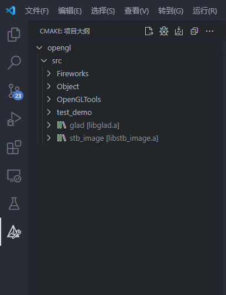

2. ctrl+shift+P 打开选项, 输入 set build target, 就是如下图中的第一个, 点击进入

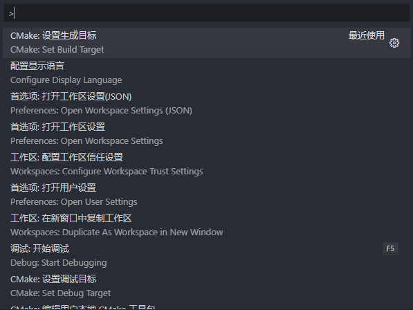

3. 进入 set build target 选项后, 可以发现有很多库文件与可执行文件(统称为目标), 选择 demo_sdl EXECUTABLE 一项, 就是把 demo_sdl 作为默认生成目标

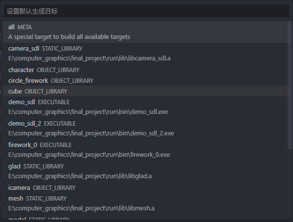

4. 完成后打开左侧边栏的 CMAke 一项, 发现 demo_sdl 上有了小火箭和小锤子, 说明配置成功

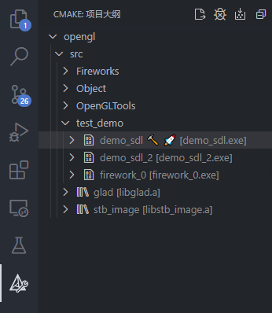

5. 最下边栏中, 从右边数第二个和第三个, 分别是小三角与小虫子, 后面跟着 [demo_sdl], 点击三角即可运行 demo_sdl, 点击小虫子即可调试 demo_sdl. (调试的时候记得在源代码里打断点.) 

    再往前有一个小齿轮+生成, 后面跟着的 [demo_sdl] 就是默认生成的可执行文件, 点击小齿轮即可编译该文件. 

    把鼠标放上去即可查看每一项的功能

6. 补充: 运行/调试指定的可执行文件. 在左边栏 CMake 中, 右击想要运行/调试的可执行文件, 结果如下图. 
- **生成** :重新编译该文件
- **调试** :开始调试该文件
- **在终端中运行** :新创建一个 vscode 终端并在新创建的终端中运行
- **打开 CMakeLists.txt** :打开生成该可执行文件/库文件的 CMakeLists.txt
- **设置为生成目标** :当点击下面的小齿轮时, 就会编译逆设置的生成目标
- **设置为启动/调试目标** :当点击下面的小虫子和小三角时, 就会调试/运行你设置的启动/调试目标

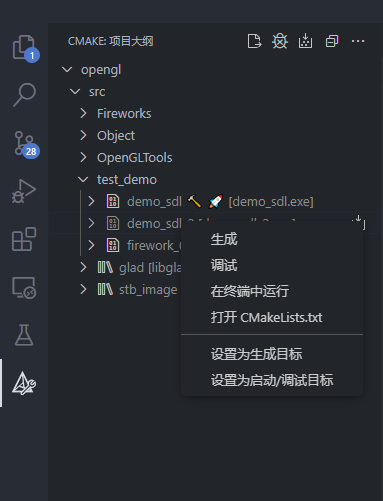