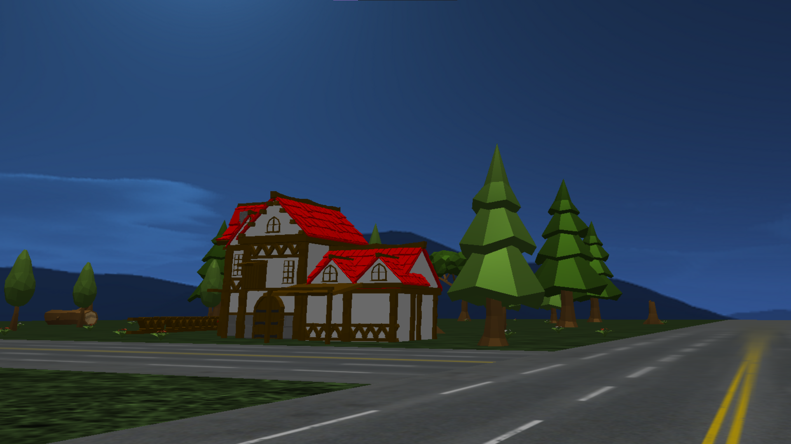

# 计算机图形学期末项目报告

## 一.项目介绍

#### (一) 实现效果


#### (二) 小组分工

| 姓名 | 学号 | 担任工作 |
| :--: | :--: | :------: |
|      |      |          |
|      |      |          |
|      |      |          |
|      |      |          |

#### (三) 项目代码框架


## 二. 粒子系统的构建 （Particles）

#### (一) 粒子与发射器类(Particle and Emitter)

##### 粒子类

|参数|类型|描述|
|--|--|--|
|`position`|`vec3`|粒子在世界坐标系下的位置|
|`color`|`vec4`|粒子具有的颜色以及透明度(rgba)|
|`size`|`float`|着色器中赋值给glPointSize的值, 代表粒子的大小, 实际中还会除以与摄像机的距离|
|`velocity`|`vec3`|粒子当前帧具有的速度, 包括大小和方向|
|`lifetime`|`int64_t`|粒子剩余的存活时间, 单位为毫秒|
|`totallifetime`|`int64_t`|粒子总共具有的存活时间, 该参数用于实现对粒子颜色, 速度等参数的特殊更新操作|

```c++
struct Particle {
    glm::vec3 position;
    glm::vec4 color;
    float size;
    glm::vec3 velocity;
    int64_t lifetime;
    int64_t totallifetime;
    inline bool alive() { return lifetime > 0; }
};
```

##### 发射器接口

接口 `EmitParticle` 用于对粒子设置不同的初始参数, 本程序中预设了三种发射器: 直线型, 圆型, 球型. 使用这三种发射器配合一些特殊参数的设置可以满足几乎所有烟花类型的创建要求.

```c++
class Emitter {
public:
    virtual void EmitParticle(Particle& particle) = 0;
public:

    /**********************
    *      必要参数        *
    **********************/

    glm::vec3 emitter_center;                // 粒子产生的中心位置, 发射器的中心
    glm::vec4 particle_color;                // 发射器产生的粒子的颜色
    float particle_size;                     // 粒子大小
    uint64_t particle_lifetime;              // 粒子生命周期
    float particle_initial_velocity;         // 粒子初速度
    glm::vec3 particle_initial_direction;    // 发射粒子的方向, 设置时会normalize
    glm::vec3 particle_initial_acceleration; // 发射粒子的加速度
    uint64_t emission_delta_time;            // 发射粒子的时间间隔
    unsigned int texture;                    // 粒子使用的纹理
    glm::vec3 emitter_velocity;              // 发射器的速度
    glm::vec3 emitter_acceleration;          // 发射器的加速度
    EmitterType emitter_type;                // 发射器类型, 见 EmitterType 定义

    /**********************
    *      可选选项        *
    **********************/
    float emitter_radial_acceleration;       // 粒子发射器径向加速度
    float lifetime_tolerance;                // 粒子生命周期误差范围 相对于生命周期的百分比
}
```

**发射器类型**

**线型发射器**

额外添加散度参数, 描述粒子在发射器发射方向上的随机偏离程度, 并限定范围从 0 到 1, 其中 0 代表完全不偏离初始方向, 1 代表完全随机方向.

对于设置的散度 `divergence`, 判断它是否为 0, 如果为 0 则直接用粒子发射器的发射方向乘以发射器发射粒子的速度作为该粒子的初速度, 否则产生一个从发射方向原点指向一个半径为散度的球面上随机点的方向向量作为粒子的初始方向, 并据此计算初速度. 

```c++
if (divergence == 0.0f) particle.velocity = particle_initial_velocity * particle_initial_direction;
else particle.velocity = particle_initial_velocity * glm::normalize(particle_initial_direction - 2.0f * divergence * glm::normalize(glm::sphericalRand(divergence)));
```

**圆型发射器**

额外添加半径与方向类型参数, 半径是发射器产生的粒子所在的圆周的半径(只会在圆周上产生, 圆的内部不会产生), 方向类型分为 `outer` 和 `diret` 两种, `outer` 会以圆心向外随机方向发射处于圆平面内的粒子, `diret` 会产生沿发射器发射方向运动的粒子. 发射平面是与粒子发射器发射方向正交的平面, 通过在粒子发射器中心位置建立坐标系获得该平面, 下面是建立坐标系的代码:

```c++
// 旋转轴
glm::vec3 axis = particle_initial_direction;
// 与 axis 正交的一个速度向量 src
glm::vec3 src = axis;
if (src.x != 0) { src.y += 1; src = particle_initial_velocity * glm::normalize(glm::cross(src, particle_initial_direction)); }
else if (src.y != 0) { src.z += 1; src = particle_initial_velocity * glm::normalize(glm::cross(src, particle_initial_direction)); }
else if (src.z != 0) { src.x += 1; src = particle_initial_velocity * glm::normalize(glm::cross(src, particle_initial_direction)); }
else {
    // 如果速度为 0 默认在 x-z 平面生成圆
    src = particle_initial_velocity * glm::vec3(1.0f, 0.0f, 1.0f);
    axis = glm::vec3(0.0f, 1.0f, 0.0f);
}
// 第二个正交向量
glm::vec3 src2 = glm::normalize(glm::cross(axis, src));
/*
    以上建立了一个以发射器为原点的单位正交坐标系(axis - src- src2)
*/
// 根据方向类型生成速度
// 随机线性组合 src 与 src2 得到一个正交于 axis 的随机方向向量
// velocity 为指向圆心外的单位速度 或者 为0
glm::vec3 velocity = glm::normalize(static_cast<float>(glm::linearRand(-1.0, 1.0)) * src2 + static_cast<float>(glm::linearRand(-1.0, 1.0)) * src);
if (direction_type == DirectionType::Outer) {
    particle.velocity = particle_initial_velocity*velocity;
}
else {
    particle.velocity = particle_initial_velocity * particle_initial_direction;
}
// radius * velocity 限定偏移在圆周上或圆心
particle.position = emitter_center + radius * velocity;
particle.color = particle_color;
particle.size = particle_size;
```

**球型发射器**

额外参数与圆型一致, 且含义类似, 这里不再赘述, 实现思路见代码:
```c++
// 随机生成朝向球心外方向的速度
if (direction_type == DirectionType::Outer) particle.velocity = particle_initial_velocity * glm::normalize(glm::sphericalRand(1.0f));
else particle.velocity = particle_initial_velocity * particle_initial_direction;
// 空间中产生随机方向
// 然后限定偏移在半径上
particle.position = emitter_center + radius * glm::normalize(glm::sphericalRand(1.0f));
particle.color = particle_color;
particle.size = particle_size;
```

#### (二) 粒子发射器 （Particle_Emitter）

粒子发射器主要用于维护一个粒子数组, 但其本身也拥有一些属性用于更新自身状态以及产生粒子的方式. 最主要的是它拥有一个 `Emitter` 基类指针, 可以用于设置三种基本发射器类型之一. 

##### 参数

|参数|类型|描述|
|-|-|-|
|`max_particle_num`|`uint64_t`|数组最大容纳的粒子数|
|`particles`|`std::vector<Particle>`|发射器维护的粒子数组|
|`emitter`|`std::shared_ptr<Emitter>`|发射器接口, 用于设置粒子参数|
|`valid`|`bool`|粒子发射器是否有效|
|`lifetime`|`int64_t`|粒子发射器的存活时间|
|`total_lifetime`|`int64_t`|粒子发射器拥有的总存活时间|
|`emit_time_passby`|`uint64_t`|粒子发射器距离上一次发射经过的时间|
|`last_generate_index`|`uint64_t`|上一次产生的粒子所在的数组下标|

##### 选项

粒子发射器可以设置的选项, 默认全部都是关闭状态

|参数|类型|描述|
|-|-|-|
|`one_shoot`|`bool`|一次性发射所有粒子, 然后不再发射|
|`enable_color_interpolation`|`bool`|启用对粒子颜色的线型插值更新|
|`color_interpolation`|`Interpolation<vec4>`|粒子颜色的插值标记点|
|`enable_velocity_interpolation`|`bool`|启用对粒子速度的线性插值更新|
|`velocity_interpolation`|`Interpolation<float>`|粒子速度的插值标记点|
|`enable_lifetime_interpolation`|`bool`|启用粒子生命值线性插值|
|`lifetime_interpolation`|`Interpolation<int64_t>`|粒子生命值插值标记点|
|`enable_emitter_radial_acc`|`bool`|启用粒子发射器径向加速度|
|`radial_axle`|`vec3`|粒子发射器径向加速度指向的中心轴|

##### 实现细节

1. 维护与更新粒子数组

使用 `Emit` 方法添加粒子, 使用 `Update` 方法更新新粒子状态. 其中 `Emit` 方法分为两步: 查找一个空闲的数组位置, 然后使用 `Emitter` 指向的基本发射器接口设置粒子参数. 这里再构造函数中预先分配好了 `max_particle_num` 大小的数组, 避免了添加时重新分配内存的问题, 同时会顺序循环查找第一个生命值小于等于 0 的粒子并替换它, 减少了删除粒子时数组前移导致的拷贝开销. 

```c++
// 检查最早使用过的粒子
    for (uint32_t i = last_generate_index;i < max_particle_num;i++) {
        if (!particles[i].alive()) {
            // 设置粒子参数 ... 
            return;
        }
    }
    // 从头开始检查
    for (uint32_t i = 0;i < last_generate_index;i++) {
        if (!particles[i].alive()) {
            // 设置粒子参数 ... 
            return;
        }
    }
    // 全部占满后 抢占最早创建的粒子
    ++last_generate_index;
    // 设置粒子参数 ... 
```

更新粒子需要遍历整个粒子数组, 这里需要合理的设置粒子数组的大小, 让数组时刻保持几乎满的状态, 以此来避免遍历死亡粒子造成的额外开销. 在已知粒子发射器发射间隔与粒子总生命值的情况下, 粒子数组的大小应该略大于粒子总生命值除以发射间隔(粒子生命值可能有一定的随机性, 所以不可以刚好等于, 不然会抢占还没有死亡的粒子的位置). 

```c++
    if (!valid) return valid; // 失效粒子不进行更新
    int count = 0; // count 用于统计存活的粒子
    emit_time_passby += deltatime; // 更新距离上一次发射经过的时间
    if (lifetime > 0) lifetime -= deltatime; // 更新粒子发射器生命值
    // 判断发射条件, 如果满足就发射粒子
    if (!one_shoot && emit_time_passby > emitter->emission_delta_time && lifetime > 0) {
        emit_time_passby -= emitter->emission_delta_time;   // 回退发射间隔
        Emit(); // 发射粒子
    }
    float delta_time_second = static_cast<float>(deltatime) / 1000.0f;  // 计算经过的时间(秒)
    // 更新所有粒子
    for (auto& particle : particles) {
        if (particle.alive()) { // 只有存活的粒子需要更新
            // 粒子更新参数 ... (此处略)
            count++; // 记录存活粒子数
        }
    }
    // 粒子更新参数 ... (此处略)
    if (count == 0 && (one_shoot || emit_time_passby > emitter->emission_delta_time)) {
        valid = false;
    }
    return valid;
```

这里重点解释一下粒子发射器 `valid` 的判断标准. 粒子发射器具有存活时间, 当粒子发射器存活时间归零后, 它就不再发射粒子了. 但是先前由它发射的粒子可能还未彻底消散, 如果此时将 `valid` 置为 `false`, 则那些未消散的粒子就会产生不正常的突然消失. 所以必须等检查粒子数组中的所有粒子都死亡后, 粒子发射器才可以置为失效, 同时渲染器将会删除该粒子发射器的记录, 也就不在渲染它(这里在粒子渲染器部分详细解释).

2. 一个线性插值模板

完成线性插值需要记录一个 值-时间 对(称之为插值标记点), 用一个模板实现, 这将会用于后面粒子更新选项中. 一个线性插值类中会维护一个插值标记点的数组, 根据经过的时间进行两个插值标记点之间进行线性插值.

```c++
template<typename T>
struct Interpolation_Tag {
    T value;
    float t;
};
```

插值操作会遍历插值标记点的数组, 找到当前时间所处的两个插值标记点之间的位置, 然后对这两个插值标记点进行线性插值.

```c++
void GetInterpolation(T& value, float t) {
        for (int i = 1;i < tags.size();i++) {
            if (tags[i].t >= t) {
                value = static_cast<T>(((t - tags[i - 1].t) * tags[i].value + (tags[i].t - t) * tags[i - 1].value) / (tags[i].t - tags[i - 1].t));
                return;
            }
        }
    }
```

3. 粒子更新选项

每一个粒子更新选项都是一个 `bool` 变量, 有的还会额外带有对应的参数. 同时具有 `Enable` 和 `Disable` 方法.

`oneshoot` 选项: 一次性发射所有粒子后不再发射, 通过将粒子发射间隔设置为 `0xffffffff` 来使得发射器不会在程序运行中再次发射粒子.

`enable_color_interpolation` 选项: 对粒子的颜色进行线性插值的更新方法, 使得粒子在它的生命周期的不同时间点具有不同的颜色, 这个选项对粒子发射器的所有粒子使用.

`enable_velocity_interpolation` 选项: 对粒子的运动速度进行线性插值的更新方法, 使得粒子在生命周期内具有不同的速度. 比如爆炸效果中, 粒子的速度在一开始很快, 但是到后面又会很慢, 这就可以激活这个选项进行插值更新.

`enable_lifetime_interpolation` 选项: 对粒子生命值设置的初始值会根据粒子发射器的生命值进行插值更新, 使得粒子发射器在不同时间内发射的粒子具有不同的总存活时间. 可以实现粒子同时消失的效果等.

`enable_emitter_radial_acc` 选项: 激活粒子发射器的径向加速度, 假定粒子发射器的运动方向为 `dire`, 径向加速度的轴为 `axle`, 那么其具有的径向加速度方向将朝向 `cross(axle, dire)`

`lifetime_tolerance` 选项: 该选项位于 `Emitter` 类中, 用于给粒子赋初始生命值的时候用到, 范围为 $[0, 1)$ 代表相对于初始生命值的百分比偏差. 使用这个选项可以使粒子具有相对随机的初始生命值.

4. 粒子以及发射器的更新

发射器/粒子位置: 使用速度乘以单位时间来求得当前帧的位移.
发射器/粒子速度: 使用加速度乘以单位时间求得当前帧的速度增加量, 如果激活了径向加速度, 发射器还应该增加径向加速度.
粒子颜色: 在激活了颜色线性插值的基础上才会对颜色进行更新.

5. 粒子渲染数据

粒子的渲染使用统一渲染的方式, 渲染器会存储一个粒子发射器的指针数组, 每次更新时, 渲染器都会调用发射器的 `Upload` 函数收集当前发射器需要渲染的粒子数据, 包括位置, 颜色, 大小.

6. 补充一点粒子发射器的构造

因为粒子发射器基于三种基本的发射器(线, 圆, 球), 而每个基本发射器所需要的参数各不相同, 所以粒子发射器的构造函数是用了可变参数列表, 在参数基本发射器类型后跟着参数包, 在构造函数中会根据基本发射器类型对参数包进行展开, 并设置对应的基本发射器.

```c++
va_list args;
va_start(args, _e_type);
switch (_e_type) {
case EmitterType::Line: {
    double div = va_arg(args, double);
    emitter = std::make_shared<LineEmitter>(static_cast<float>(div));
    break;
}
case EmitterType::Circle: {
    double radius = va_arg(args, double);
    int type = va_arg(args, int);
    emitter = std::make_shared<CircleEmitter>(static_cast<float>(radius), static_cast<DirectionType>(type));
    break;
}
case EmitterType::Sphere: {
    double radius = va_arg(args, double);
    int type = va_arg(args, int);
    emitter = std::make_shared<SphereEmitter>(static_cast<float>(radius), static_cast<DirectionType>(type));
    break;
}
default:
    emitter = std::make_shared<LineEmitter>(0.0f);
    break;
}
va_end(args);
```

#### (三) 粒子渲染类 (Particle_Render)

粒子渲染器类主要负责了粒子系统中所有和渲染相关的工作，主要函数和变量如下：

```c++
class Emitter_Render {
public:
    Emitter_Render(ICamera* cam); //创建shader，连接camera，创建VAO VBO，生成纹理
    void AddEmitter(std::shared_ptr<ParticleEmitter> new_emitter); //增加发射器
    void AddPointLight(glm::vec3 _pos, glm::vec3 _col); // 添加点光源
    const std::vector<float>& GetPointLight(); // 返回点光源
    void ClearPointLight(); // 清空点光源
    void Update_and_Collect(uint64_t millisecond_passby); //收集所有粒子的信息，自动删除死亡的粒子发射器
    void Render(); //渲染粒子
    ~Emitter_Render(); //删除shader，vao，vbo
protected:
    std::vector < std::shared_ptr<ParticleEmitter> > particle_emitters; // 需要渲染的所有的粒子发射器
    std::vector<float> light_points_buffer; // 所有烟花的点光源
    std::vector<float> vbo_buffer; // 缓存所有粒子的数据
    ......其他相关变量
};
```

具体来说，粒子渲染类Emitter_Render主要实现以下三个功能：

**1. 维护一个粒子发射器列表particle_emitters，记录待渲染的发射器**

通过AddEmitter函数可以直接将粒子发射器添加到particle_emitters列表中

```cpp
void Emitter_Render::AddEmitter(std::shared_ptr<ParticleEmitter> new_emitter) {
    emitter_vector_mtx.lock();
    particle_emitters.push_back(new_emitter);  //添加
    emitter_vector_mtx.unlock();
}
```

在Update_and_Collect函数中，如果检测到一个粒子发射器中的粒子全部死亡，则会将这个粒子发射器从particle_emitters列表中删除

```cpp
for (auto it = particle_emitters.begin();it != particle_emitters.end();) {
    if ((*it)->isValid()) {
        //...
    }
    else {
        it = particle_emitters.erase(it);
    }
}
```

**2. 维护一个烟花点光源列表light_points_buffer，记录所有烟花中心点光源位置和颜色信息**

在后面实现的烟花类中，可以利用AddPointLight函数传入点光源的位置和颜色信息，该函数会将其保存在light_points_buffer列表中

```cpp
void Emitter_Render::AddPointLight(glm::vec3 _pos, glm::vec3 _col) {
    light_point_mxt.lock();
    light_points_buffer.push_back(_pos.x);
    light_points_buffer.push_back(_pos.y);
    light_points_buffer.push_back(_pos.z);
    light_points_buffer.push_back(_col.r);
    light_points_buffer.push_back(_col.g);
    light_points_buffer.push_back(_col.b);
    light_point_mxt.unlock();
}
```

在场景实现中，可以利用GetPointLight函数获取light_points_buffer中记录的的所有点光源信息，用于场景中pling-phone光照模型的实现

```cpp
const std::vector<float>& Emitter_Render::GetPointLight() {
    return light_points_buffer;
}
```

ClearPointLight可以清空light_points_buffer列表

```cpp
void Emitter_Render::ClearPointLight() {
    light_points_buffer.clear();
}
```

**3.维护一个VBO缓冲vbo_buffer，一次性获取列表中粒子发射器中所有粒子信息**

调用函数Update_and_Collect，遍历列表particle_emitters，若发射器存活，则将其中所有存活的粒子传给vbo_buffer，否则将发射器从列表particle_emitters中删除

```c++
void Emitter_Render::Update_and_Collect(uint64_t millisecond_passby) {
    vbo_buffer.clear(); //收集前要清空vbo buffer
    for (auto it = particle_emitters.begin();it != particle_emitters.end();) {
        if ((*it)->isValid()) { //存活
            (*it)->Upload(vbo_buffer); //上传存活粒子
            ++it;
        }
        else {//死亡
            it = particle_emitters.erase(it); //删除
        }
    }
}
```

在主函数调用render即可将vbo buffer中的所有粒子信息一同传给VBO并渲染到屏幕中

```cpp
void Emitter_Render::Render() {
    glBlendFunc(GL_SRC_ALPHA, GL_ONE);
    glDepthMask(GL_FALSE);

    glBindVertexArray(VAO);
    glBufferData(GL_ARRAY_BUFFER, vbo_buffer.size() * sizeof(float), vbo_buffer.data(), GL_DYNAMIC_DRAW);//动态更新VBO，会自动改变大小
    glBindTexture(GL_TEXTURE_2D, texture);// 绑定纹理 **必需**
    shader.use();
    shader.setMat4("view", camera->GetViewMatrix());
    shader.setMat4("projection", glm::perspective(glm::radians(camera->Zoom), 800.0f / 600.0f, 0.1f, 100.0f));
    shader.setVec3("camera_pos", camera->Position);
    shader.setInt("texture1", 0);
    glDrawArrays(GL_POINTS, 0, vbo_buffer.size() / 8);//绘制VBO中的所有点

    glDepthMask(GL_TRUE);
    glBlendFunc(GL_SRC_ALPHA, GL_ONE_MINUS_SRC_ALPHA);
}
```


## 三. 世界构建 (World)

#### (一) 天空盒及地面的搭建 (Skybox and Background)

天空盒主要为放置烟花，以及燃放烟花提供背景，这里我们选择使用夜晚的星空作为天空盒的背景。

##### 天空盒主要属性如下

| 参数           | 类型         | 描述                 |
| -------------- | ------------ | -------------------- |
| skyboxVertices | float[108]   | 存储立方体顶点数据   |
| skyboxVAO      | unsigned int | 天空盒顶点数组对象   |
| skyboxVBO      | unsigned int | 天空盒顶点缓冲对象   |
| skyboxShader   | Shader       | 天空盒着色器         |
| cubemapTexture | unsigned int | 存储天空盒对应的纹理 |
| camera         | ICamera*     | 表示摄像机的指针     |

##### 实现细节

- 立方体纹理导入

  ```cpp
  unsigned int loadCubemap(std::vector<std::string> faces) { //faces这里表示输入的图片的相对路径或者绝对路径数组
      unsigned int textureID; // 定义需要被绑定的纹理引用
      glGenTextures(1, &textureID);
      glBindTexture(GL_TEXTURE_CUBE_MAP, textureID); //绑定textureID
  
      int width, height, nrComponents;
      for (unsigned int i = 0; i < faces.size(); i++) {
          unsigned char* data = stbi_load(faces[i].c_str(), &width, &height, &nrComponents, 0); //通过stbi_load函数导入对应的图片数据
          if (data) {
              glTexImage2D(GL_TEXTURE_CUBE_MAP_POSITIVE_X + i, 0, GL_RGB, width, height, 0, GL_RGB, GL_UNSIGNED_BYTE, data); //这里形成了一个枚举enum，随着GL_TEXTURE_CUBE_MAP_POSITIVE_X的递增，将会遍历faces里面的纹理
              stbi_image_free(data);
          }
          else { //导入失败进行提示
              std::cout << "Cubemap texture failed to load at path: " << faces[i] << std::endl;
              stbi_image_free(data);
          }
      }
  
      ......
  
      return textureID;
  }
  ```

- 着色器细节，由于天空盒本身就是立方体贴图，其顶点数据就是一个立方体的顶点集合，同时，如果该立方体的中心是(0,0,0)，此时其每个位置向量，刚好是从原点出发的方向向量（恰好和纹理坐标构成对应的关系），因此我们的着色器内不用显示提供纹理坐标，而是通过位置向量即可获得。

  ```cpp
  //顶点着色器
  #version 330 core
  layout (location = 0) in vec3 aPos; //只需要提供位置向量就可以了
  
  out vec3 TexCoords;
  
  uniform mat4 projection;
  uniform mat4 view;
  
  void main()
  {
      TexCoords = aPos; //这里直接借用位置向量来代替纹理坐标
      gl_Position = projection * view * vec4(aPos, 1.0);
  }
  
  //片段着色器
  #version 330 core
  out vec4 FragColor;
  
  in vec3 TexCoords;
  
  uniform samplerCube skybox;
  
  void main()
  {    
      FragColor = texture(skybox, TexCoords);//借助前面的位置向量来完成对于skybox纹理（里面有6个纹理形成一个立方体贴图）的采样
  }
  ```

- skybox类的主要函数的作用如下

  - skybox(...), ~skybox(): 完成类初始化和析构
  - draw(): 每次调用的时候进行对于天空盒的渲染
  - loadCubemap(...): 批量导入立方体贴图

- 实现效果如下：

  

##### 地面主要属性如下

| 参数                                                  | 类型                     | 描述                                     |
| ----------------------------------------------------- | ------------------------ | ---------------------------------------- |
| mcamera                                               | Camera*                  | 存储摄像机的指针                         |
| ourShader                                             | Shader*                  | 存储shader类型的指针，对应着色器的初始化 |
| vertices                                              | float[288]               | 存储顶点位置，纹理坐标，法向量信息       |
| cubePositions                                         | std::vector\<glm::vec3\> | 存储组成地面的每个方块的位置             |
| h                                                     | int                      | 存储地面的长                             |
| w                                                     | int                      | 存储地面的宽                             |
| z                                                     | float                    | 存储地面的高度                           |
| VAO,VBO                                               | unsigned int             | 表示顶点数组对象和缓冲对象               |
| texture1,texture2,texture3,texture4,texture5,texture6 | unsigned int             | 存储对应的纹理引用                       |

##### 实现细节

- 首先构建组成地面的基本单位立方体的渲染，首先通过导入的立方体的顶点坐标，纹理坐标，法向量（这里的法向量是为了后面试下多光源着色器方便起见预先导入的），然后通过绑定前面属性中的某一个texture，从而构建基本单位立方体的渲染，

  - 简易代码如下：

  ```cpp
  Background(int h, int w, int z, Camera* mcamera) : h(h), w(w), z(z), mcamera(mcamera) {
          ......
          float vertices_t[] = {//初始化前面提到过的立方体的顶点坐标纹理坐标法向量
              // positions          // normals           // texture coords
              -0.5f, -0.5f, -0.5f,  0.0f,  0.0f, -1.0f,  0.0f,  0.0f,
              ......
          };
          ......
  }
  
  void draw(const std::vector<float> light) {
      ......
      for (unsigned int i = 0; i < cubePositions.size(); i++)
      {
          ......
          if(ny == h) {//绑定公路纹理
              glActiveTexture(GL_TEXTURE0);
              glBindTexture(GL_TEXTURE_2D, texture2);
          }
          else if(nx == w && ny != h) {//绑定另一侧的公路纹理
            ......
          }
          else if(nx == w+1 || nx == w-1 || ny == h+1 || ny == h-1){//绑定青苔石纹理
            ......
          }else{ //绑定草坪纹理
            ......
          }
          ......
          glDrawArrays(GL_TRIANGLES, 0, 36); //进行渲染
          ......
      }
  }
  ```

- 地面的构建，就可以通过上面的许多个立方体进行拼接搭建而成，有点类似搭积木的过程，而每个立方体的位置可以通过存储在上面属性中的cubePositions里面的偏移向量，通过做平移操作即可。这样我们就可以初步搭建起来一个平面了。

  - 简易代码如下：

  ```cpp
  void draw(const std::vector<float> light) {
      ......
      for (unsigned int i = 0; i < cubePositions.size(); i++)
      {
          ......
          if(ny == h) {//绑定公路纹理
              glActiveTexture(GL_TEXTURE0);
              glBindTexture(GL_TEXTURE_2D, texture2);
          }
          else if(nx == w && ny != h) {//绑定另一侧的公路纹理
            ......
          }
          else if(nx == w+1 || nx == w-1 || ny == h+1 || ny == h-1){//绑定青苔石纹理
            ......
          }else{ //绑定草坪纹理
            ......
          }
          ......
          model = glm::translate(model, cubePositions[i]); //进行偏移
          ......
          glDrawArrays(GL_TRIANGLES, 0, 36); //进行渲染
          ......
      }
  }
  ```

  - 效果如下：
    

（注：最终代码选择在模型部分直接构建并导入地面，因此最终版本地面实现没有采用这个方法，但地面效果几乎相同）

#### (二) 相机实现视角移动（Camera）

视角的移动本质上控制的是摄像机的位置以及朝向向量，因此我们自定义摄像机类里面的函数即可。

- 实现细节

  - 首先是通过键盘来控制当前朝向的左右前后移动，这里新加入了跳跃飞行判定，具体说来就是，按键F会在飞行模式和行走模式中进行切换，空格则是控制是否跳跃（仅在当前位于可跳跃状态，并且为行走模式下，如果在飞行模式下，其为上升效果），同时加入地面检测，防止摄像头穿模（也就是对于摄像机的y坐标进行特判约束即可）。

  ```cpp
  void Camera_GLFW::ProcessKeyboard() {
      if (glfwGetKey(window, GLFW_KEY_ESCAPE) == GLFW_PRESS) glfwSetWindowShouldClose(window, true); //退出处理
      if (glfwGetKey(window, GLFW_KEY_W) == GLFW_PRESS) Position += glm::normalize(glm::vec3(Front.x, 0, Front.z)) * velocity; //省略部分就是正常的根据键盘上的wasd进行相对应的位移
  
      ......
  
      if (glfwGetKey(window, GLFW_KEY_SPACE) == GLFW_PRESS) {
          if (is_view_mode) { // 行走模式
              if (!jumping) {
                  jump_init_velocity = 2.0f; // 跳跃初速度
                  jumping = true;
              }
          }
          else {  // 飞行模式
              Position.y += velocity;
              jumping = true;
          }
      }
  
      // 处理命令类的按键消息 间隔时间比较长 且不会在连续几帧内重复出现
      current_handle_second = glfwGetTime();
      if (last_handle_second + 0.2 < current_handle_second) { // 假定每 0.1 秒才会输入一次命令类的按键
          last_handle_second = current_handle_second;
          // F 切换飞行/行走(view)模式
          if (glfwGetKey(window, GLFW_KEY_F) == GLFW_PRESS) is_view_mode = !is_view_mode;
      }
  
      // 跳跃 下落
      if (is_view_mode) { // 行走模式
          if (jumping) {
              jump_init_velocity -= velocity * 3.0; // 重力加速度
              Position.y += velocity * jump_init_velocity;
          }
      }
      // 地面检测
      if (Position.y < 0.0f) {
          Position.y = 0.0f;
          jumping = false;
      }
  }
  ```

  - 对于鼠标则是控制摄像机的旋转方向，也就是捕捉当前鼠标的位置变化，然后以一定的速率对当前的摄像机按照欧拉角更新对应的front, up, right向量（可视化的表现就展示出所看到的屏幕在旋转）

  ```cpp
  void Camera_GLFW::ProcessMouseMovement(double _xpos, double _ypos) {
      if (firstMouse) {
          lastX = _xpos;
          lastY = _ypos;
          firstMouse = false;
      }//进行初始化，防止由于未初始化带来的巨大的屏幕旋转
  
      float xoffset = (_xpos - lastX) * MouseSensitivity;
      float yoffset = (lastY - _ypos) * MouseSensitivity; // reversed since y-coordinates go from bottom to top
  
      lastX = _xpos;
      lastY = _ypos;
  
      Yaw += xoffset;
      Pitch += yoffset;
  
      // 确保当俯仰角超过90度时 屏幕不会翻转
      if (constrainPitch) {
          if (Pitch > 89.0f)
              Pitch = 89.0f;
          if (Pitch < -89.0f)
              Pitch = -89.0f;
      }
  
      // 根据欧拉角更新 front up right 向量
      updateCameraVectors();
  }
  ```


#### (三) 鞭炮模型的构建与放置（Firebox）

烟花模型涉及相关模型的构建与放置，里面的烟花模型借助立方体堆积而成一个小型鞭炮的模样，同时也是一个数组进行存储这些鞭炮的绝对位置，并且内置了放置也就是下面将要介绍的push函数，以及清除鞭炮也就是下面的clear函数，同时一开始的时候会有一个略暗的辅助鞭炮方便用户进行鞭炮的放置。

##### 主要属性

地面场景使用 blender 搭建, 并导出 obj 格式文件加入 opengl 项目中. 其中使用的模型以及纹理都是来自与网络, 为了解决一些模型导入opengl的纹理映射问题以及保持模型的风格统一, 我们都是用 low ploy 风格的模型. 整个场景的 blender 文件放在 run/bin/Object/scence/ 中, 项目中导入 all_in_one.obj 就是整个场景. 下图是在 blnder 中搭建的场景截图, 其中地面是公路纹理的平面和草地纹理的平面拼接而成.


实际中, 我们整个场景是在黑夜这个环境下, 同时增加一定亮度的平行光, 并实现了烟花爆炸产生的 Blinn-Phong 光照效果.



**代码实现**

绘制场景的 `draw(const std::vector<float> light)` 方法, 输入参数为烟花爆炸产生的点光源信息, 每个点光源信息分为 `position(vec3)` 和 `color(vec3)`, 将所有点光源信息按照 float 数组的形式传入.

```c++
void draw(const std::vector<float> light) {
    model_shader.use();
    int max_len = 0;
    if (light.size() / 6 < 1000) {
        max_len = light.size() / 6;
        model_shader.setInt("max_len", max_len);
    }
    else {
        max_len = 1000;
        model_shader.setInt("max_len", max_len);
    }
    model_shader.setVec3("dirLight.direction", -0.2f, -1.0f, -0.3f);
    model_shader.setVec3("dirLight.ambient", 0.3f, 0.3f, 0.3f);
    model_shader.setVec3("dirLight.diffuse", 0.4f, 0.4f, 0.4f);
    model_shader.setVec3("dirLight.specular", 0.5f, 0.5f, 0.5f);
    model_shader.setVec3("dirLight.lightcolor", 1.0f, 1.0f, 1.0f);

    char buf[1000];
    for (int i = 0; i < max_len; i++) {
        sprintf(buf, "pointLights[%d].position", i);
        model_shader.setVec3(buf, light[i * 6], light[i * 6 + 1], light[i * 6 + 2]);
        sprintf(buf, "pointLights[%d].ambient", i);
        model_shader.setVec3(buf, 0.05f, 0.05f, 0.05f);
        sprintf(buf, "pointLights[%d].diffuse", i);
        model_shader.setVec3(buf, 0.8f, 0.8f, 0.8f);
        sprintf(buf, "pointLights[%d].specular", i);
        model_shader.setVec3(buf, 1.0f, 1.0f, 1.0f);
        sprintf(buf, "pointLights[%d].constant", i);
        model_shader.setFloat(buf, 1.0f);
        model_shader.setFloat("pointLights[0].linear", 0.09f);
        sprintf(buf, "pointLights[%d].quadratic", i);
        model_shader.setFloat(buf, 0.032f);
        sprintf(buf, "pointLights[%d].lightcolor", i);
        model_shader.setVec3(buf, light[i * 6 + 3], light[i * 6 + 4], light[i * 6 + 5]);
    }
    for (int i = max_len; i < 1000; i++) {
        sprintf(buf, "pointLights[%d].constant", i);
        model_shader.setFloat(buf, 10000.0f);
    }
    model_shader.setVec3("viewPos", camera->Position);
    model_shader.setFloat("material.shininess", 32.0f);
    glm::mat4 projection = glm::perspective(glm::radians(camera->Zoom), (float)WIN_WIDTH / (float)WIN_HEIGHT, 0.1f, 100.0f);
    model_shader.setMat4("projection", projection);
    glm::mat4 view = camera->GetViewMatrix();
    model_shader.setMat4("view", view);
    glm::mat4 model = glm::mat4(1.0f);
    model = glm::translate(model, glm::vec3(0.0f, -0.51f, 0.0f));
    model = glm::scale(model, glm::vec3(0.3f, 0.3f, 0.3f));	
    model_shader.setMat4("model", model);
    house_model.Draw(model_shader);
}
```
| 参数                                                  | 类型                         | 描述                                                         |
| ----------------------------------------------------- | ---------------------------- | ------------------------------------------------------------ |
| mcamera                                               | Camera*                      | 存储摄像机指针                                               |
| ourShader                                             | Shader*                      | 存储shader类型指针（本质上就是初始化着色器的指针）           |
| vertices                                              | float[288]                   | 存储立方体的顶点位置法向量纹理坐标相关信息                   |
| z                                                     | float                        | 存储地面的高度，与鞭炮放置位置有关，鞭炮默认只能放置在地面上，不能悬空 |
| cubePositions                                         | std::vector\<glm::vec3\>     | 存储构成鞭炮的立方体的相对位置                               |
| fireboxPostions                                       | std::vector\<glm::vec3\>     | 存储每个鞭炮的相对应的偏移量                                 |
| firework_entry                                        | std::vector\<firework_init\> | 存储每个鞭炮对应的烟花发射相关信息，这里的firework_init是一个类，里面存放了关于烟花发射的各种信息，具体将会在下面介绍 |
| VAO,VBO                                               | unsigned int                 | 存放顶点数组对象，缓冲对象                                   |
| texture1,texture2,texture3,texture4,texture5,texture6 | unsigned int                 | 存储对应的纹理引用                                           |

##### 鞭炮模型的构建

- 鞭炮模型的构建与上面的场景的搭建有异曲同工之处，也是先渲染单个立方体，然后通过堆叠这些立方体逐渐构建整个鞭炮模型，也就是通过将这些方块的偏移量存储在cubePositions里面，然后循环进行渲染，这里的纹理绑定，则是通过这边循环的顺序进行特殊判定来绑定即可。

  - 简易代码如下：

    ```cp
    Firebox(float z, Camera* mcamera) : z(z+1), mcamera(mcamera) {
    
        ......
    
        float vertices_t[] = {
            // positions          // normals           // texture coords
            -0.5f, -0.5f, -0.5f,  0.0f,  0.0f, -1.0f,  0.0f,  0.0f,
            ......
        }; //初始化立方体顶点位置，法向量，纹理数据
    
        ......
    
        for(int i = 1; i < 15; i++) {
            cubePositions.push_back(glm::vec3(-2.0f, 1.0f*i, 0.0f)*size+glm::vec3(0.0f, z-z*size+0.5f, 0.0f));
            ......
        }
        cubePositions.push_back(glm::vec3(2.0f, 1.0f*14, 0.0f)*size+glm::vec3(0.0f, z-z*size+0.5f, 0.0f)); //进行鞭炮模型的搭建，本质上就是将这些方块的局部位置放到cubePositions里面，然后等到draw的时候进行渲染就可以了
        ......
    }
    
    void draw(const std::vector<float> light) {
        ......
        for(unsigned int j = 0; j < fireboxPositions.size(); j++) {
    
            ......
    
            for (unsigned int i = 0; i < cubePositions.size(); i++)
            {
    
                ......
    
                if(i / 12 == 1 || i / 12 == 12) { //根据序号绑定对应的纹理，然后通过遍历cubePositions数组来进行鞭炮模型的渲染
                    glActiveTexture(GL_TEXTURE0); // 渲染鞭炮外壳
                    glBindTexture(GL_TEXTURE_2D, texture5);
                }
                else if(i >= 14*12+12) {
                    glActiveTexture(GL_TEXTURE0); // 渲染鞭炮外壳
                    glBindTexture(GL_TEXTURE_2D, texture6);
                }else{
                    glActiveTexture(GL_TEXTURE0); //渲染绳子
                    glBindTexture(GL_TEXTURE_2D, texture4);
                }
    
                glDrawArrays(GL_TRIANGLES, 0, 36); //进行渲染单个立方体
            }
        }
    ```

  - 这里单个渲染的鞭炮模型的视觉效果如下：

    

- 接下来介绍对于鞭炮模型的放置功能的实现，以及鞭炮的初始化具体过程。这里先对上面提到的firework_init进行简单的介绍（这涉及到鞭炮的初始化过程）

  ##### firework_init类的简要介绍

  - firework_init的主要属性如下：

    | 参数            | 类型      | 描述                   |
    | --------------- | --------- | ---------------------- |
    | _type           | int32_t   | 存放燃放烟花的种类     |
    | init_v          | float     | 烟花发射的初始速度     |
    | init_pos        | glm::vec3 | 烟花发射的初始位置     |
    | init_dire       | glm::vec3 | 烟花发射的初始方向     |
    | init_color      | glm::vec4 | 烟花发射的颜色         |
    | b_time          | int64_t   | 烟花发射的时间         |
    | _init_node_type | int32_t   | 烟花发射的最开始的种类 |

  - firwork_init的初始化，主要是设定烟花的种类，速度，持续时间，颜色等属性，代码如下：

    ```cpp
    firework_init(glm::vec3 init_pos, int32_t _type) : init_pos(init_pos), _type(_type) {//这里接受由鞭炮放置时候获得的位置，以及对应的种类
        init_v = 10.0f + rand() % 1000 / 100.0f; //初始化烟花速度
        init_dire = glm::vec3(0.0f, 1.0f, 0.0f); //初始化烟花方向，固定为竖直向上
        init_color = glm::vec4(rand() % 256 / 255.0f, rand() % 256 / 255.0f, rand() % 256 / 255.0f, rand() % 256 / 255.0f); //初始化烟花的颜色
        b_time = 2000 + glm::linearRand(-500.0f, 500.0f); //初始化烟花的存在时间
        _init_node_type = 0; //rand() % 3; //初始化烟花的最开始的发射方式
    }
    ```

 ##### 鞭炮放置的实现

 - 这里鞭炮的放置主要借助fireboxPositions实现。仍然是将鞭炮的位置存放在fireboxPositions里面，然后后面在draw函数里面渲染的时候循环遍历fireboxPositions里面的位移向量（做一个平移变换）就可以进行渲染。

 - 首先我们定义一个放置函数push，该函数被调用的时候，会自动根据当前摄像机的位置，front的朝向，计算出和地面的交点，从而获得放置到fireboxPositions里面的偏移向量的大小。同时，因为鞭炮模型的默认初始位置为(0,0,0)，所以这里的偏移向量也可以当作是鞭炮的位置向量，因此传递给前面提到过的firework_init类进行对于这个鞭炮对应燃放的烟花信息的绑定。简易代码如下：

   ```cpp
   void push() {//进行鞭炮的放置函数
       glm::vec3 front = mcamera->Front; //获取摄像机的朝向
       glm::vec3 pos = mcamera->Position; //获取摄像机的位置
       float size = 0.01f;
       float frac = pos[1] - z + z*size - 1.5f + 2.0f;
       if(!fireboxPositions.empty()) {
           firework_entry.push_back(glm::vec3(front[0]/front[1]*-frac+pos[0], 0, front[2]/front[1]*-frac+pos[2])); //初始化对应这种鞭炮的绑定烟花类型
       }
       fireboxPositions.push_back(glm::vec3(front[0]/front[1]*-frac+pos[0], 0, front[2]/front[1]*-frac+pos[2])); //初始化鞭炮的位置信息
   }
   ```

  - 接着我们定义一个clear函数，实现清除场地中的所有鞭炮，其实也就是将fireboxPositions里面的元素全部清除掉即可。具体代码如下：

    ```cpp
    void clear() {
        fireboxPositions.clear(); //清除鞭炮的位置信息
        firework_entry.clear(); //清除鞭炮绑定的对应的烟花信息
    }
    ```

  - 关于渲染的问题，则是通过循环遍历fireboxPositions里面的偏移向量，对上面提到的鞭炮模型做一个平移变换然后进行渲染即可。具体代码如下：

    ```cpp
    void draw(const std::vector<float> light) {
    
        ......
    
        for(unsigned int j = 0; j < fireboxPositions.size(); j++) { //循环遍历fireboxPositions进行鞭炮的渲染
    
            ......
    
            for (unsigned int i = 0; i < cubePositions.size(); i++) //对于单个鞭炮模型的渲染
            {
                ......
                model = glm::translate(model, cubePositions[i]); //对应单个鞭炮模型的单个立方体的相对位置
                model = glm::translate(model, fireboxPositions[j]); //对应鞭炮模型在地面的相对位置偏移
                ......
            }
        }
    }
    ```

  - 关于辅助鞭炮放置的设置，这里为了方便用户对于鞭炮的放置，会预先显示出一个虚拟的鞭炮的位置，颜色比正常的模型暗淡一点。这样就可以更简单的自由排列鞭炮。具体实现上，也就是检测fireboxPositions，如果一旦为空，那就往里面添加一个位置始终跟随摄像机朝向有关的鞭炮位置向量。这样就能保证fireboxPostions里面的第一个一定是这个辅助的虚拟鞭炮。具体代码如下：

    ```cpp
    void draw(const std::vector<float> light) {
        if(fireboxPositions.empty()) { //如果fireboxPositions为空，那就往里面添加虚拟鞭炮的位置，这个函数一般只在初始化，以及执行clear后被调用，其他情况下则只需要调整fireboxPositions的第一个元素的位置即可
            push();
        }
    
        glm::vec3 front = mcamera->Front;
        glm::vec3 pos = mcamera->Position;
        float size = 0.01f;
        float frac = pos[1] - z + z*size - 1.5f + 2.0f;
        fireboxPositions[0] = glm::vec3(front[0]/front[1]*-frac+pos[0], 0, front[2]/front[1]*-frac+pos[2]); //使这个虚拟的辅助鞭炮的位置和摄像机的朝向方向相关
        ......
    }
    ```

  - 效果展示：

    - 左边是已经放置的鞭炮，右边是虚拟的辅助放置鞭炮

      

    - 下面是通过放置鞭炮组成的文字`SYSU 100`
                                               

#### (四) 场景模型的构建（environment）


## 四. 烟花实现 

#### (一)泛光（lmj）


#### (二)光照bling phone（ljr，xr）

对于烟花粒子编辑器的光照bling phone模型，区别于原先的单光源渲染，在烟花粒子编辑器里面每个粒子都会对某点的纹理产生一定的点光源效果，也就是多光源的渲染。因此，首先由于所选的天空盒是晚上，仍然是有月光，因此我们默认始终会有一个平行光源（可以当作月光），同时会有一个数组，如果燃放烟花开始，则会往该数组里面存放这些粒子的位置信息以及色彩信息，然后调用计算点光源的bling phone函数，最后将这些光源的总的效果加起来与纹理相乘即可获得多光源渲染后的纹理颜色了。

- 因此点着色器的代码如下：

  ```cpp
  #version 330 core
  layout (location = 0) in vec3 aPos; //获取位置向量
  layout (location = 1) in vec3 aNormal; //获取法向量
  layout (location = 2) in vec2 aTexCoords; //获取纹理坐标
  
  out vec3 FragPos; //输出位置向量
  out vec3 Normal; //输出法向量
  out vec2 TexCoords; //输出纹理坐标
  
  uniform mat4 model;
  uniform mat4 view;
  uniform mat4 projection;
  
  void main()
  {
      FragPos = vec3(model * vec4(aPos, 1.0));
      Normal = mat3(transpose(inverse(model))) * aNormal;  
      TexCoords = aTexCoords;
  
      gl_Position = projection * view * vec4(FragPos, 1.0);
  }
  ```

- 片段着色器的代码如下：

  ```cpp
  ......
  
  #define MAX_LEN 20
  
  uniform vec3 viewPos; //位置向量
  uniform DirLight dirLight; //平行光源
  uniform int max_len; //最多渲染的粒子数
  uniform PointLight pointLights[MAX_LEN]; //对应的粒子位置信息和色彩信息
  uniform Material material; //材质信息
  uniform sampler2D texture1; //纹理信息
  
  ......
  
  void main()
  {    
      vec3 norm = normalize(Normal);
      vec3 viewDir = normalize(viewPos - FragPos);
      
      vec3 result = 0.7*CalcDirLight(dirLight, norm, viewDir); //需要一直有自然光的照射
      for(int i = 0; i < max_len; i++)
          result += CalcPointLight(pointLights[i], norm, FragPos, viewDir); //点光源的叠加，这里如果没有点光源，那么max_len为0
  
      result = result * vec3(texture(texture1, TexCoords)); /
      FragColor = vec4(result, 1.0); 
  }
  
  vec3 CalcDirLight(DirLight light, vec3 normal, vec3 viewDir) //平行光源的计算
  {
      ......
      vec3 ambient = light.ambient * light.lightcolor; //环境光
      vec3 diffuse = light.diffuse * diff * light.lightcolor; //漫反射光
      vec3 specular = light.specular * spec * light.lightcolor; //镜面反射光
      return (ambient + diffuse + specular);
  }
  
  vec3 CalcPointLight(PointLight light, vec3 normal, vec3 fragPos, vec3 viewDir) //点光源的计算
  {
      ......
      float distance = length(light.position - fragPos);
      float attenuation = 1.0 / (light.constant + light.linear * distance + light.quadratic * (distance * distance)); //计算衰减系数    
  
      vec3 ambient = light.ambient * light.lightcolor; //环境光
      vec3 diffuse = light.diffuse * diff * light.lightcolor; //漫反射光
      vec3 specular = light.specular * spec * light.lightcolor; //镜面反射光
      ambient *= attenuation;
      diffuse *= attenuation;
      specular *= attenuation;
      return (ambient + diffuse + specular);
  }
  ```

- 效果如下：

  - 没有发射烟花时候的地面
    
  - 发射烟花后的地面
    

#### (三) 烟花声音（lmj，lws）

烟花声音使用 SDL_Mixer 库实现, 项目中实现了一个 `Sound_Player` 类用于播放声音, 因为只适用于烟花爆炸等简单声效, 所以实现也比较简单. 在构造函数中使用 `Mix_LoadWAV` 和 `Mix_LoadMUS` 载入需要的音频文件.

```c++
if (!boom.empty()) boom.clear();
for (int i = 0;i < 5;i++) {
    path = std::string("sound/firework_boom") + std::to_string(i) + std::string(".wav");
    Mix_Chunk* temp = Mix_LoadWAV(path.data());
    if (temp != NULL) {
        boom.push_back(temp);
        Mix_VolumeChunk(temp, 50);
    }
}
```

当需要播放声音时就调用 `PlayOne` 方法, 根据输入的音效类型将随机播放一个对应类型的音效, 比如本项目中爆炸音效有五种, 每次就会从中随机播放一个.

```c++
if (boom.size() != 0) {
    int index = rand() % boom.size();
    Mix_PlayChannel(-1, boom[index], 0);
}
```

#### (四)各种烟花管理器和各种类烟花？（lws）

##### 烟花类

本项目实现了一种类似流水线的烟花, 每一级都可以有不同的效果且可以无限(内存足够的话)串联下去, 实现多级爆炸的烟花.


首先, 定义一个创建粒子发射器的函数类型, 这在烟花流水节点中起到一个类似指针的作用.
```c++
typedef std::function<bool(std::list<Firework_Pipeline_Node>&, std::shared_ptr<Emitter_Render>, Firework_Pipeline_Node&)> PipelineFunction;
```

烟花流水节点具有一个 `created_next` 代表该节点是否已经执行过 `Create_Next` 方法, `particle_emitter` 是粒子发射器类的指针, 代表这个节点的发射器, 在创建节点的时候需要给他设置初始值. `Create_Next` 方法将会创建一个新的烟花节点, 并添加到它参数列表中的 `std::list<Firework_Pipeline_Node>&` 中, 除非 `Create_Next` 方法是 `pipe_end` 即烟花流水的终点.

```c++
struct Firework_Pipeline_Node {
    bool created_next;
    std::shared_ptr<ParticleEmitter> particle_emitter;
    PipelineFunction Create_Next;
};
```

接下来, 为了更清晰的介绍该类的执行方式, 举一个多级烟花的例子.

烟花具有预设的初始节点, 以 0 号初始节点为例:

```c++
first_emitter->SetParticleEmitter(
        80,                                         // 最大粒子数
        b_time,                                     // 粒子发射器生命值
        init_pos,                                   // 粒子发射器中心
        4.0f * init_color,                          // 粒子颜色
        100,                                        // 粒子大小
        500,                                        // 粒子生命周期
        0.01f,                                      // 粒子初速度
        glm::vec3(0, -1, 0),                        // 粒子初始方向
        glm::vec3(0, -0.005, 0),                    // 粒子加速度
        10,                                         // 粒子发射间隔
        0,                                          // 纹理
        init_v,                                     // 发射器移动速度
        init_dire,                                  // 发射器运动方向
        glm::vec3(0.0f, -0.1f, 0.0f),               // 发射器加速度
        EmitterType::Sphere,                        // 粒子发射器类型
        0.0f,                                       // 圆形粒子发射器-半径
        DirectionType::Outer                        // 圆形粒子发射器-朝向类型
    );
    first_emitter->EnableVelocityUpdater(1.0f, 0.0f);
    first_emitter->AddMidVelocity(0.0, 0.7);
    first_emitter->EnableColorUpdater(glm::vec4(1.0f, 1.0f, 1.0f, 1.0f), glm::vec4(0.0f, 0.0f, 0.0f, 1.0f));
    first_emitter->AddMidColor(glm::vec4(1.0f, 1.0f, 1.0f, 1.0f), 0.5);
    first_emitter->EnableLifetimeTolerance(0.2);
```
上面的参数将实现一个向上飞行且带有拖尾的粒子发射器, 如下图所示:


定义两个烟花流水节点的函数, 也就是烟花节点中的 `Create_Next` 函数, 代表我们要实现一个两级爆炸的烟花.

```c++
bool pipe0_0(std::list<Firework_Pipeline_Node>&, std::shared_ptr<Emitter_Render>, Firework_Pipeline_Node&);
bool pipe0_1(std::list<Firework_Pipeline_Node>&, std::shared_ptr<Emitter_Render>, Firework_Pipeline_Node&);
```

pipe0_0 将创建 30 个流水节点添加到流水节点链表中, 每个节点的粒子发射器参数如下代码:

```c++
Firework_Pipeline_Node new_node;
for (int i = 0;i < 30;i++) {
    new_node.created_next = false;
    // 设置粒子发射器
    new_node.particle_emitter = std::make_shared<ParticleEmitter>(
        50,                                   // 最大粒子数
        2000,                                  // 发射器生命
        father.particle_emitter->GetEmitterCenter(),      // 粒子发射器中心
        glm::vec4(1.0f, 1.0f, 0.5f, 1.0f),      // 粒子颜色
        100,                                     // 粒子大小
        2000,                                    // 粒子生命周期
        0.01f,                                      // 粒子初速度
        glm::normalize(glm::vec3(0, 1, 0)),        // 粒子初始方向
        glm::vec3(0, -0.005, 0),                     // 粒子加速度
        50,                                     // 粒子发射间隔
        0,                                      // 纹理
        3.0f,                                    // 发射器移动速度
        glm::sphericalRand(1.0f),// 发射器运动方向
        glm::vec3(0.0f, -1.0f, 0.0f),            // 发射器加速度
        EmitterType::Sphere,                    // 粒子发射器类型
        0.0f,                                       // 圆形粒子发射器-半径
        DirectionType::Outer                  // 圆形粒子发射器-朝向类型
    );
    new_node.particle_emitter->EnableColorUpdater(glm::vec4(1.0f, 1.0f, 1.0f, 1.0f), glm::vec4(0.0f, 0.0f, 0.0f, 0.0f));
    new_node.particle_emitter->EnableLifetimeTolerance(0.2);
    // 设置下一节点
    new_node.Create_Next = pipe0_1;
    // 添加到节点列表
    nodes.push_front(new_node);
    // 添加到渲染器
    render->AddEmitter(new_node.particle_emitter);
}
```

实现效果见下图


pipe0_1 将实现一个橙色的球型烟花, 在 pipe0_0 结束的位置产生, 因为前面 pipe0_0 产生了 30 个流水节点, 所以这里 pipe0_1 会被这 30 个流水节点分别调用, 从而产生 30 个球型烟花. pipe0_1 的下一个节点设置为了 pipe_end 所以该节点执行完毕后就不会再产生新的流水节点了.

```c++
Firework_Pipeline_Node new_node;
new_node.created_next = false;
// 设置粒子发射器
new_node.particle_emitter = std::make_shared<ParticleEmitter>(
    50,                                   // 最大粒子数
    100,                                    // 发射器生命值
    father.particle_emitter->GetEmitterCenter(),      // 粒子发射器中心
    glm::vec4(1.0f, 1.0f, 0.5f, 1.0f),      // 粒子颜色
    200,                                     // 粒子大小
    3000,                                    // 粒子生命周期
    5.0f,                                      // 粒子初速度
    glm::normalize(glm::vec3(0, 1, 0)),        // 粒子初始方向
    glm::vec3(0, -2.0, 0),                     // 粒子加速度
    10,                                     // 粒子发射间隔
    0,                                      // 纹理
    0.0f,                                    // 发射器移动速度
    glm::vec3(0, 1, 0),            // 发射器运动方向
    glm::vec3(0.0f, 0.0f, 0.0f),            // 发射器加速度
    EmitterType::Sphere,                    // 粒子发射器类型
    0.0f,                                       // 圆形粒子发射器-半径
    DirectionType::Outer                  // 圆形粒子发射器-朝向类型
);
new_node.particle_emitter->EnableColorUpdater(glm::vec4(1.0f, 0.7f, 0.5f, 1.0f), glm::vec4(0.0f, 0.2f, 0.1f, 0.1f));
new_node.particle_emitter->AddMidColor(0.7f * glm::vec4(1.0f, 0.7f, 0.5f, 1.0f), 0.7);
new_node.particle_emitter->EnableLifetimeTolerance(0.2);
new_node.particle_emitter->EnableOneShoot();
new_node.particle_emitter->EnableVelocityUpdater(5.0f, 0.0f);
new_node.particle_emitter->AddMidVelocity(1.0f, 0.4f);
// 设置下一节点
new_node.Create_Next = pipe_end;
// 添加到节点列表
nodes.push_front(new_node);
// 添加到渲染器
render->AddEmitter(new_node.particle_emitter);
```

实现效果见下图


**烟花类的更新**

遍历所有的烟花流水节点, 并对粒子发射器进行更新, 因为粒子发射器将返回其是否 `valid`, 所以对 `Update` 返回值进行判断, 如果失效需要删除该节点, 否则进一步判断是否需要调用 `Create_Next` 方法. 调用 `Create_Next` 方法将会创建新一个或多个流水节点.

这里还添加了一个爆炸音效, 只在第一次爆炸时才会产生, 同时产生一个点光源, 并将光源信息交付给渲染器.

```c++
for (auto it = nodes.begin();it != nodes.end();) {
    if (it->particle_emitter->Update(delta_ms)) {
        if (!it->particle_emitter->isAlive() && !it->created_next) {
            it->created_next = true;
            if (it->Create_Next(nodes, emitter_render, (*it))) { // 需要产生光源
                boom_lighting = true;
#ifdef SDL2_LIB
                sound_player->PlayOne(Sound_Type::BOOM);
#endif
                light_pos = it->particle_emitter->GetEmitterCenter();
                light_col = it->particle_emitter->GetEmitterColor();
            }
        }
        ++it;
    }
    else {
        it = nodes.erase(it);
        boom_lighting = false;
    }
}
if (boom_lighting) {    // 将光源信息传递给 render
    emitter_render->AddPointLight(light_pos, light_col);
}
return !nodes.empty();
```

##### 烟花管理类

烟花管理类是对烟花流水类的进一步封装, 为的是简化参数的设置, 不过也降低了创建烟花的灵活性.

烟花管理类维护一个流水烟花的数组, 该数组中存放有效的烟花, 因为烟花比较少而且存放的是指针所以这里就直接是用了数组.

```c++
std::vector<std::shared_ptr<Pipe_Firework>> fireworks;
```

创建一个烟花需要提供烟花的位置, 颜色, 初始方向, 初始速度, 第一次爆炸时间, 烟花类型, 烟花上升阶段的类型. 然后创建一个流水节点并添加到数组中即可.

```c++
fireworks.push_back(std::make_shared<Pipe_Firework>(
        _type,
        render,
#ifdef SDL2_LIB
        player,
#endif
        init_v,
        init_pos,
        init_dire,
        init_color,
        b_time,
        _init_node_type
        ));
```

烟花的更新使用了 openmp 进行并行处理, 为了避免线程访问不存在的数组节点, 将更新与删除分离开, 删除操作串行处理. 不过这仍不能彻底解决多线程带来的问题, 另外还需要注意两个地方.

```c++
void Pipe_Firework_Manager::Update(uint64_t deltatime) {
    render->ClearPointLight();
#pragma omp parallel for
    for (int i = 0;i < fireworks.size();i++) {
        fireworks[i]->Update(deltatime);
        //std::cout << "thread:" << omp_get_thread_num() << std::endl;
    }

    for (auto it = fireworks.begin();it != fireworks.end();) {
        if ((*it)->isValid()) ++it;// 如果烟花中还有节点需要更新 就保留
        else it = fireworks.erase(it); // 否则删除该烟花
    }
}
```

需要注意的地方
1. 粒子渲染器的 `particle_emitters`
在更新烟花时, 烟花会向粒子渲染器中添加自己的粒子发射器指针, 当使用多线程时, 可能会出现两个烟花放进同一个数组位置的情况, 所以需要对粒子渲染器的粒子发射器指针数组进行互斥操作.
2. 粒子渲染器的 `light_points_buffer`
与 `particle_emitters` 类似, 烟花爆炸时会向渲染器添加自己的点光源信息, 多个烟花同时爆炸就可能会添加到同一个数组位置.

解决办法就是给这两个数组各添加一个互斥锁.

## 五. 总结


